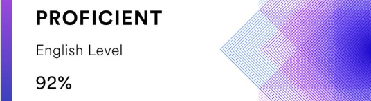

# Tatsiana Bandelikova
### *Frontend Developer*
-----
### Contacts
* phone number: +37544-5970340
* e-mail: tat.bandelikova@gmail.com
* discord: TatsianaB (@tbandelikova)
* LinkedIn: [Tatsiana Bandelikova](https://www.linkedin.com/in/tatsiana-bandelikova/)
* GitHub: [tbandelikova](https://github.com/tbandelikova)
-----
### Summary
As a frontend developer, I am highly motivated to continually expand my skills and work diligently. Thanks to my prior work experience, I have developed the ability to responsibly manage my schedule and meet deadlines. I approach both work and study with patience and diligence.

Pursuing a career in this field offers the opportunity to work remotely and continuously enhance one's expertise. I am eager to further develop my abilities as part of a team of active and passionate specialists in a new domain.

-----
### Skills
* HTML, CSS, Sass
* JS, TS, React
* VSCode, GitHub, Figma
-----
### Code Example
**Bit Counting Kata from Codewars:** Write a function that takes an integer as input, and returns the number of bits that are equal to one in the binary representation of that number. You can guarantee that input is non-negative.

```
var countBits = function(n) {
  return n.toString(2).split('').filter(i => i == 1).length;
};
```
-----
### Courses
* **The Rolling Scopes School**
    *JAVASCRIPT/FRONT-END 2023Q1(JAVASCRIPT)*,
    *REACT 2023 Q1 (REACT)*
* **Algoritmika Coding Bootcamp**
    *October 2021 - May 2022 (8 months)*
* **Belarusian State Economic University**
    *2003 - 2008*
-----
### Experience, Educational projects
* **Currency Converter**
    [https://github.com/tbandelikova/Project-M3]
    HTML, CSS, Java Script
* **Catalog of precious coins**
    [https://github.com/tbandelikova/catalogue2]
    Java Script (React), CSS, Bootstrap
* **Game Dice**
    [https://codesandbox.io/s/inspiring-poincare-mm4pes?file=/src/Dice.js]
    Java Script (React), CSS
-----
### English level
Intermediate (B1)


